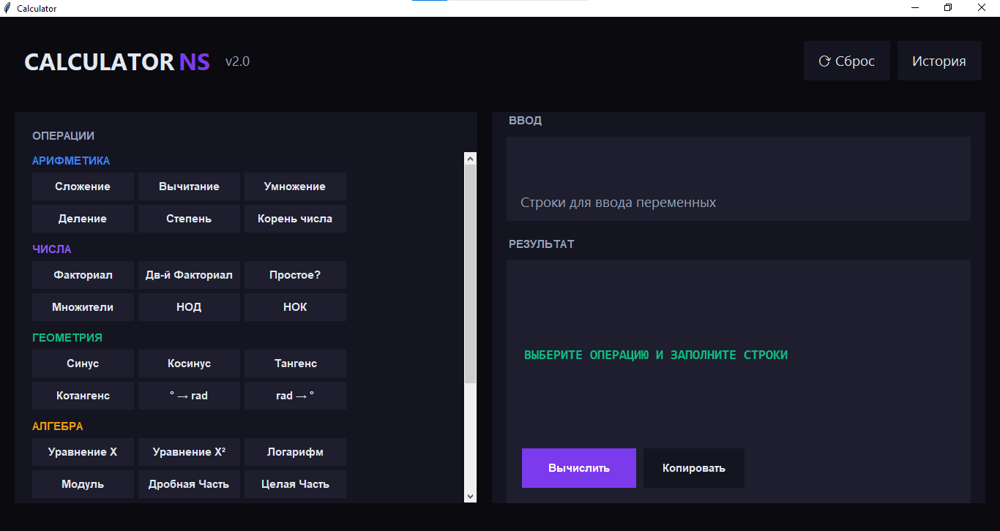
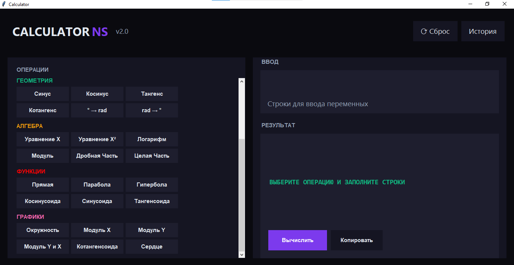
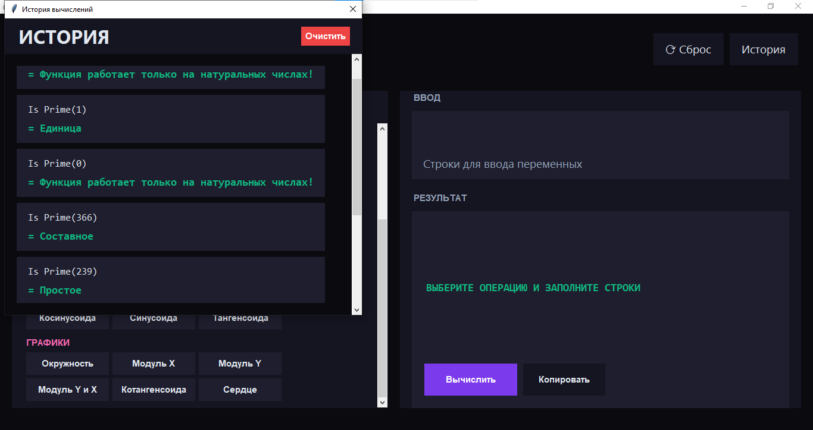
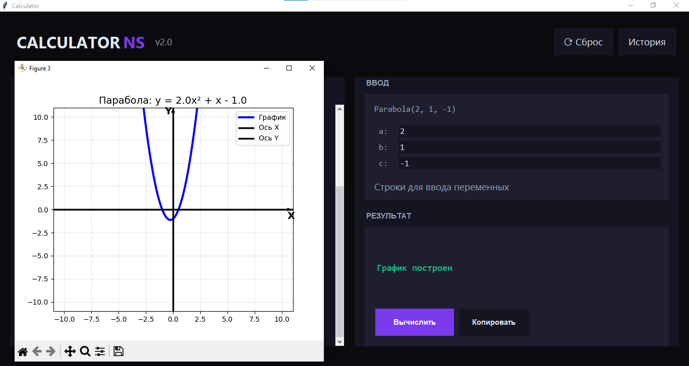
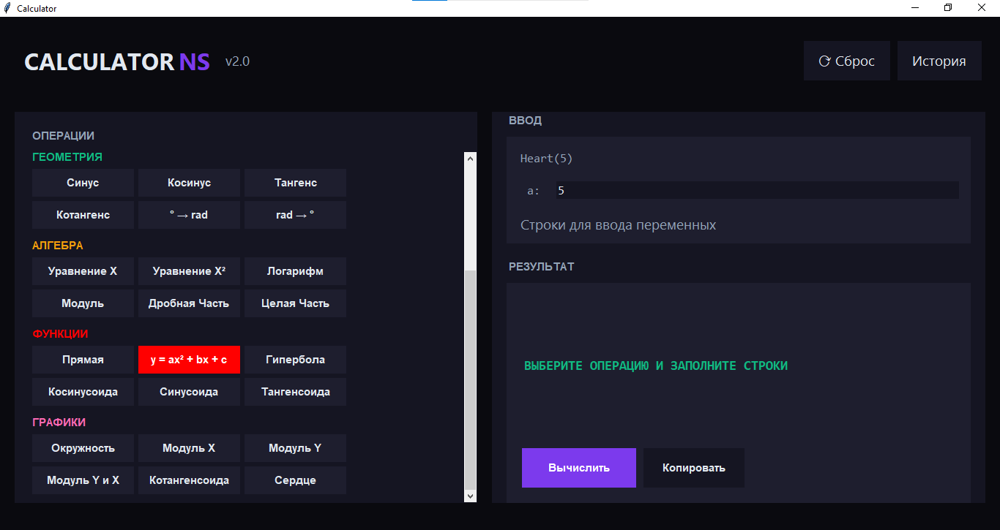

# Calculator v.2

Extended calculator with graphs and functions.

## 💻 Project Run:
- Open with Python: [Calculator_v.2.py](Calculator_v.2.py)
- Or download exe: [Calculator_v.2.exe](Calculator_v.2.exe)

## 📄 Full documentation:
- 🇷🇺  Russian version [Documentation](Calculator_v.2_RU.md)
  
- 🇺🇲  English version: [Documentation](Calculator_v.2_EN.md)

## 📷 Screenshots:

© NebulaStack
